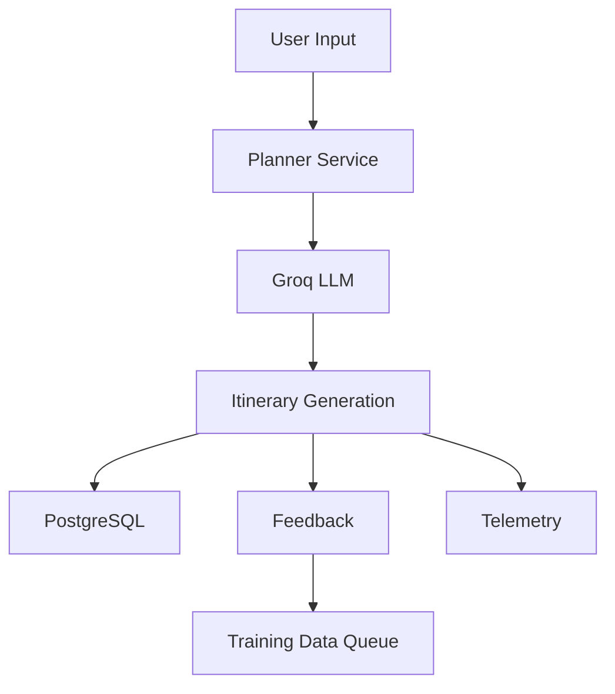

<div align="center">

<h1>Traveler LLM</h1>

<p>
<b>AI-Powered Travel Planning • Personalized Itineraries • Feedback-Driven Improvement</b>
</p>

<p>
Generate personalized travel itineraries from destination, duration, interests,
budget, and travel style — with structured feedback and telemetry supporting iterative system improvement.
</p>

<p>
<a href="https://auto-travelerllm.streamlit.app/">

</a>
<a href="https://github.com/ShadyNights/Auto-LLM-Trainer">

</a>
</p>

<p>


</p>

<p align="center">
<a href="#overview">Overview</a> •
<a href="#problem">Problem</a> •
<a href="#why-traveler-llm">Why Traveler LLM?</a> •
<a href="#key-capabilities">Features</a> •
<a href="#architecture">Architecture</a> •
<a href="#feedback--training-pipeline">Training Pipeline</a> •
<a href="#getting-started">Installation</a> •
<a href="#project-status">Status</a>
</p>

<br>

<table align="center">
<tr>
<td align="center">
<b>Interface</b><br>
Streamlit
</td>
<td align="center">
<b>Architecture</b><br>
Modular Monolith
</td>
<td align="center">
<b>Inference</b><br>
Groq LLM
</td>
<td align="center">
<b>Database</b><br>
PostgreSQL
</td>
<td align="center">
<b>License</b><br>
MIT
</td>
</tr>
</table>

</div>

---

## At a Glance

<br>

<table align="center">
<tr>
<td align="center">
🌍<br>
<b>Choose Destination</b>
</td>
<td align="center">
🧭<br>
<b>Define Preferences</b>
</td>
<td align="center">
🧠<br>
<b>Generate Itinerary</b>
</td>
<td align="center">
💾<br>
<b>Persist Results</b>
</td>
<td align="center">
⭐<br>
<b>Submit Feedback</b>
</td>
<td align="center">
🔄<br>
<b>Feedback & Training Pipeline</b>
</td>
</tr>
</table>

<br>

## Overview

Traveler LLM is a modular AI travel-planning application built around personalized
itinerary generation, structured persistence, and feedback collection. Users provide
destination, duration, interests, budget, and travel style; the application generates
an itinerary through an abstracted LLM provider and records generated itineraries, feedback, and operational telemetry in PostgreSQL, while feedback-derived training data is routed into the Feedback & Training Pipeline.

## Problem

Travel planning typically requires users to manually combine destinations,
trip duration, interests, budget constraints, and travel preferences into a
coherent itinerary. Generic travel recommendations often lack personalization,
while static itinerary generators provide limited mechanisms for measuring
whether generated plans are actually useful to users.

Traveler LLM addresses this by combining LLM-based itinerary generation with
structured persistence, user feedback, and operational telemetry.

## Why Traveler LLM?

| Conventional Travel Planning | Traveler LLM |
| :--- | :--- |
| Manual itinerary construction | AI-assisted generation |
| Generic recommendations | Preference-driven planning |
| Static planning workflows | Structured itinerary generation |
| Limited quality signals | Structured telemetry |
| Limited feedback loops | Feedback-driven pipeline |
| Provider-specific integration | LLM provider abstraction |

## Key Capabilities

| Capability | Status |
| :--- | :--- |
| Personalized itinerary generation | ✅ |
| LLM provider abstraction | ✅ |
| Structured trip persistence | ✅ |
| User ratings and feedback | ✅ |
| Generation and event telemetry | ✅ |
| Analytics dashboards | ✅ |
| Training-data collection | ✅ |
| Training queue | ✅ |
| Dataset construction | ✅ |
| Model evaluation | ✅ |
| Automated model promotion | ✅ |

## How It Works



- Users provide destination, dates, and preferences via the Streamlit UI.
- The input is passed to the Planner Service, which constructs a prompt.
- The Groq provider handles LLM inference.
- Generated itineraries are stored in PostgreSQL.
- Users can rate the itineraries and provide feedback.
- Telemetry and feedback are captured and added to a training queue for background processing.

## Architecture

Traveler LLM follows a modular-monolith architecture with clear separation between presentation, application services, repositories, infrastructure, and LLM provider integrations.

```text
                         Traveler LLM
                              │
                  ┌───────────┴───────────┐
                  │                       │
             Streamlit UI          Feedback Pipeline
                  │                       │
                  ▼                       ▼
         Application Services      Training Data Queue
                  │                       │
          ┌───────┴───────┐               ▼
          │               │       Dataset Construction
          ▼               ▼               │
     Repositories     Providers           ▼
          │               │           Evaluation
          ▼               ▼
     PostgreSQL        Groq API
```

## Tech Stack

| Layer | Technology |
|---|---|
| Language | Python |
| UI | Streamlit |
| Database | PostgreSQL 14 |
| Database Driver | psycopg2 |
| LLM Provider | Groq |
| Containerization | Docker / Docker Compose |
| Configuration | Environment variables + application configuration |

## Project Structure

```text
traveler-llm/
├── src/
│   ├── domain/
│   ├── infrastructure/
│   ├── pipelines/
│   ├── providers/
│   ├── repositories/
│   ├── services/
│   └── ui/
├── docs/
├── migrations/
├── prompts/
├── scripts/
├── .github/
├── Dockerfile
├── docker-compose.yml
├── pyproject.toml
├── requirements.txt
└── README.md
```
The source tree follows a modular architecture separating domain models, application services, persistence, infrastructure, providers, pipelines, and presentation concerns.

## Getting Started

### Prerequisites
- Python 3.10+
- Docker
- Docker Compose
- Groq API key

### 1. Clone
```bash
git clone https://github.com/ShadyNights/Auto-LLM-Trainer.git
cd Auto-LLM-Trainer
```

### 2. Configure environment
```bash
cp .env.example .env
```
Set in `.env`:
```ini
GROQ_API_KEY=gsk_your_api_key_here
DATABASE_URL=postgresql://<user>:<password>@localhost:5432/<database>
```
> Replace the placeholder credentials and database name with your local PostgreSQL configuration.

### 3. Start dependencies
```bash
docker compose up -d
```

### 4. Initialize the database
```bash
docker compose exec app python setup_database.py
```

### 5. Run application
The Streamlit application is automatically launched by Docker Compose in step 3. 
Open your browser to:
http://localhost:8501

## Feedback & Training Pipeline

```text
User Feedback
      ↓
Feedback Persistence
      ↓
Training Data Queue
      ↓
Training Dataset
      ↓
Evaluation
```

| Stage | Status |
| :--- | :--- |
| Feedback collection | ✅ Implemented |
| Training-data queueing | ✅ Implemented |
| Dataset construction | ✅ Implemented |
| Model evaluation | ✅ Implemented |
| Model promotion | ✅ Implemented |
| Automated model improvement | ✅ Implemented |

> **Current implementation note:** The complete feedback and training pipeline is implemented and operational, including feedback collection, training-data queueing, dataset construction, model evaluation, and model promotion.

## Project Status

| Area | Status |
|---|---|
| Streamlit deployment | ✅ Live |
| Docker local deployment | ✅ Working |
| Core itinerary generation | ✅ Functional |
| PostgreSQL persistence | ✅ Implemented |
| Feedback collection | ✅ Implemented |
| Telemetry | ✅ Implemented |
| Feedback & Training Pipeline | ✅ Complete |
| Automated tests | ✅ Implemented |
| Authentication / RBAC | ✅ Implemented |
| Production deployment | ✅ Operational |

## Roadmap

- [x] Personalized itinerary generation
- [x] PostgreSQL persistence
- [x] Feedback collection
- [x] Telemetry and analytics
- [x] Training-data queueing
- [x] Dataset construction
- [x] Model evaluation
- [x] Model promotion and rollback
- [x] Authentication and RBAC
- [x] Automated test suite
- [x] Production deployment hardening

## Documentation

| Document | Purpose |
| :--- | :--- |
| [Architecture](docs/architecture.md) | System architecture and design decisions |
| [Deployment Guide](docs/deployment_guide.md) | Deployment and environment configuration |
| [Operations Guide](docs/operations_guide.md) | Operational procedures and troubleshooting |
| [Database Documentation](docs/database_schema.md) | Schema and persistence model |
| [Design System](docs/DESIGN_SYSTEM.md) | UI conventions and components |
| [ADRs](docs/adr/) | Architecture Decision Records |
| [Audit Report](AUDIT_REPORT.md) | Technical audit, findings, risks, and remediation priorities |

## Security

- Never expose database credentials, API keys, or other secrets in source control.
- Rotate any credential that may have been exposed.
- Store API keys and database credentials through environment/secret management.
- Do not expose administrative or database-management interfaces publicly.
- Treat LLM-generated content as untrusted data.
- Report security issues privately rather than opening a public issue containing sensitive details.

## Development

### Format
```bash
black src
```
### Lint
```bash
ruff check src
```

## Author

**Kashif Ansari**

- GitHub: [@ShadyNights](https://github.com/ShadyNights)
- LinkedIn: [kashifansari18](https://www.linkedin.com/in/kashifansari18)

## License

This project is licensed under the MIT License.
See [LICENSE](LICENSE) for details.

<hr>

<div align="center">

<b>Traveler LLM</b>

<br><br>

Personalized Planning • Feedback-Driven Improvement • Modular AI Architecture

<br><br>

Built with Python, Streamlit, PostgreSQL, and Groq.

</div>
