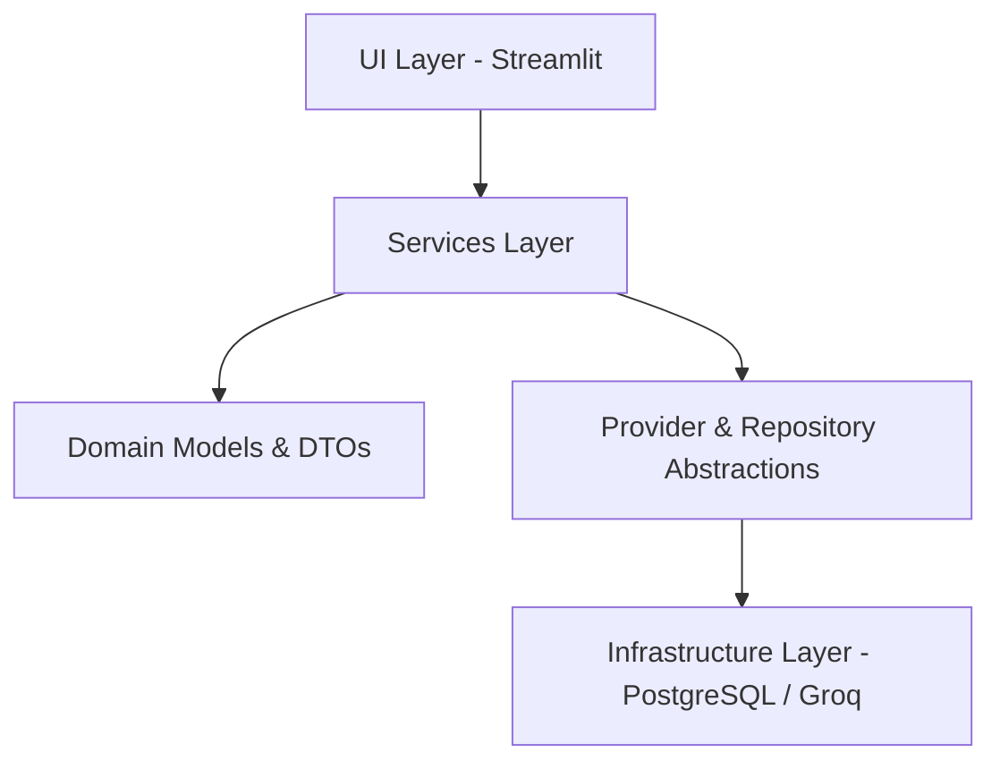

# System Architecture

> [!NOTE]
> **Traveler LLM** is a production-grade, Domain-Driven AI platform. It features a strict architectural hierarchy designed for scalability, observability, and autonomous learning via our Continuous Feedback Pipeline.

---

## Architecture Overview

The system strictly adheres to the dependency rule: dependencies point inward. The frontend knows about the services, the services know about the domain and abstractions, and the infrastructure fulfills those abstractions.

### 1. UI Layer (Streamlit)
- **Role**: Presentation and layout orchestration.
- **Components**: Driven by `app.py`. Styling is strictly decoupled using centralized HTML/CSS injection via `src/ui/styles.py` to achieve an enterprise SaaS aesthetic without heavy Javascript frameworks.
- **Responsibilities**: User input capture, session state management, and real-time environment health checks.

### 2. Services Layer
- **Role**: Core business logic and use-case orchestration.
- **Components**: 
  - `PlannerService`: Manages prompt assembly and LLM inference.
  - `EventService`: Manages telemetry, user interactions, and feedback capture.
- **Responsibilities**: Validating inputs, invoking infrastructure abstractions, and enforcing business rules.

### 3. Abstraction Layer (Repositories & Providers)
- **Role**: Decoupling business logic from external dependencies.
- **Components**: 
  - `ProviderInterface`: Exposes a unified `generate()` contract. Implemented by `GroqProvider`.
  - `Repositories`: Standardized data access (e.g., `PromptRepository`, `ItineraryRepository`).
- **Responsibilities**: Providing seamless swappability for LLM providers or databases without refactoring core services.

### 4. Infrastructure & Pipeline Layer
- **Role**: Persistence, execution, and continuous learning.
- **Components**: 
  - **PostgreSQL**: The absolute single source of truth for all system state.
  - **Learning Pipeline**: Background workers that asynchronously process user feedback (`training_queue`) to refine prompts and evaluate model performance.
- **Responsibilities**: Data integrity (ACID), background orchestration, and secure external network execution.
